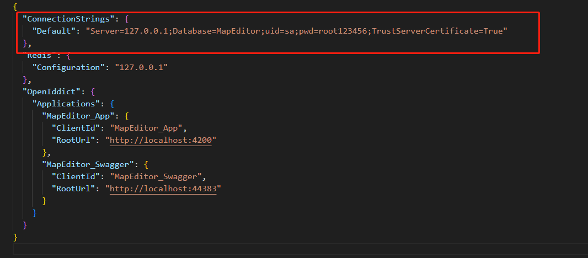
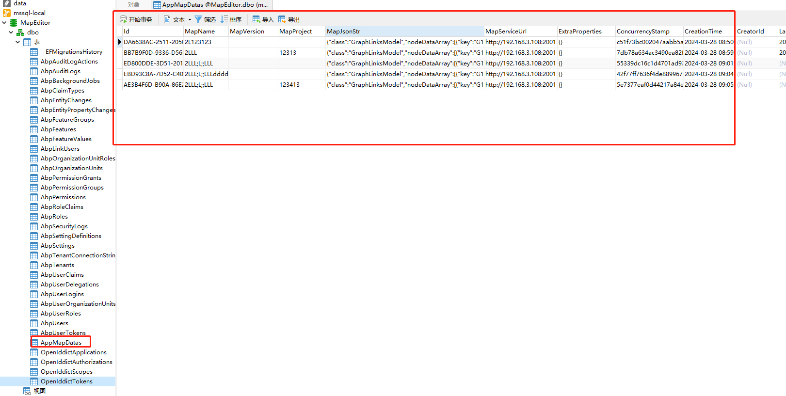
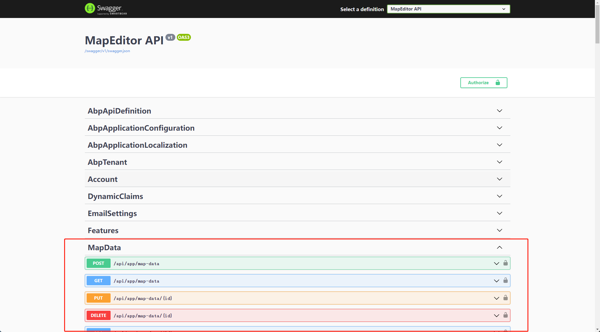
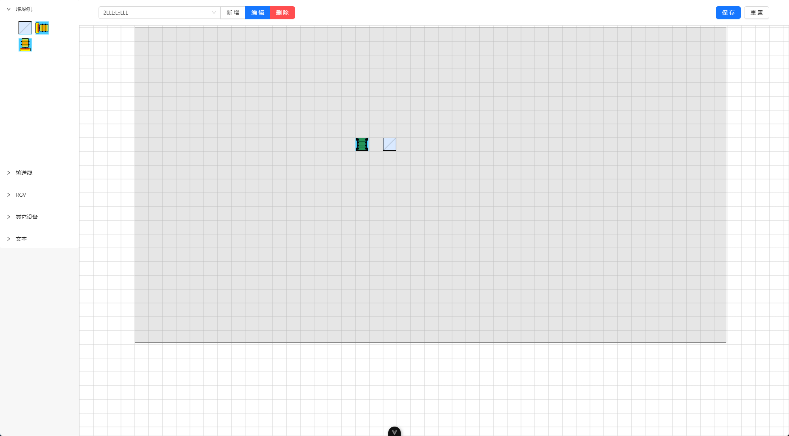
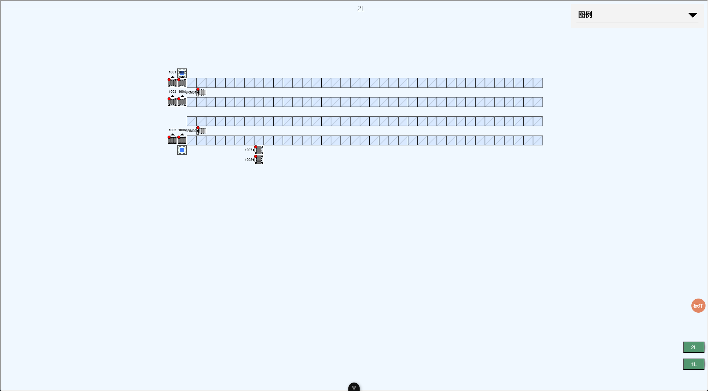

# 运行环境

- node >= 18
- dotnet = 8.0
- redis >= 5.0
- sqlserver >= 2016

# 快速启动

## 获取代码

```bash
git clone https://gitlab.com/

#目录结构
#--map-editor
#  --aspnet-core #后端代码
#  --vue-web     #前端代码
#  --README.md   #使用说明

```

## 启动后端

1. 进入 aspnet-core 文件夹，打开 Robo.Vision.MapEditor.sln 解决方案。

2. 修改数据库连接配置文件为需要连接的数据库。

   1. 修改 Robo.Vision.MapEditor.Authserver 文件夹内的 appsettings.json
   2. 修改 Robo.Vision.MapEditor.DbMigrator 文件夹内的 appsettings.json
   3. 修改 Robo.Vision.MapEditor.HttpApi.Host 文件夹内的 appsettings.json

   修改 appsettings.json 数据库连接地址
   

3. 启动 redis-server,默认连接端口号 6379
   项目默认启用 redis，如不需要 redis，请在项目中禁用 redis 配置。

4. 启动 Robo.Vision.MapEditor.DbMigrator 初始化数据库表。
   创建成功后，访问数据库可看到如下结果

   

5. 运行 Robo.Vision.MapEditor.HttpApi.Host，访问 http://localhost:44383/swagger/index.html
   成功访问后，出现以下结果
   

## 启动前端

1. 进入 vue-web 文件夹

2. 安装依赖

```bash
npm install
```

3. 启动项目

```bash
npm run dev
```

4. 访问编辑器页面

访问 http://localhost:5173/editor ，如图



1. 访问地图显示页面

访问 http://localhost:5173/display ，显示如图

